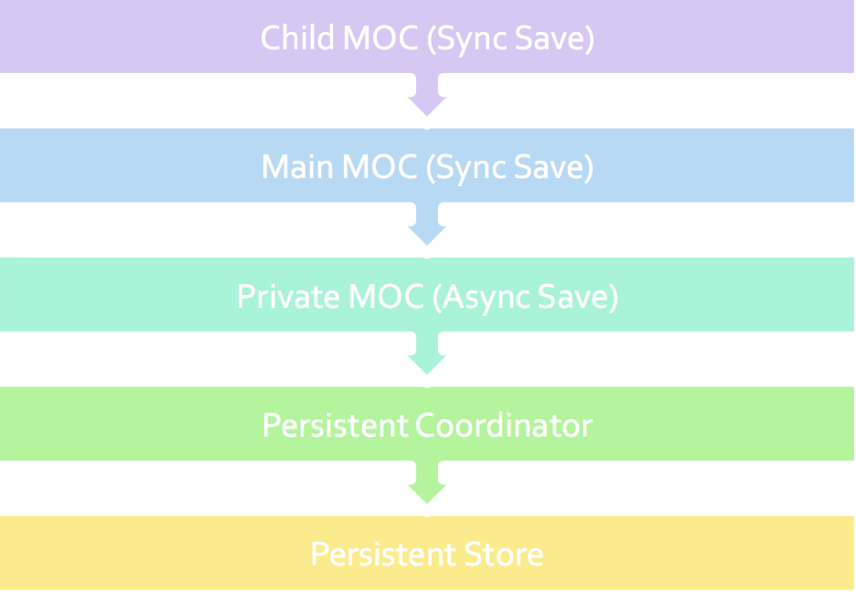

# CoreDataStack
Since CoreData is such an intresting and powerful tool provide by Apple, I built this demo app to show how I usually setup my CoreData stack

### Requirements
- Xcode 9 (Since app was built with Swift 4)

### Structure 


```
In the demo project, Main and Private MOC are implemented in PersistenceController.swift

ChildContext are used in MocGeneratedDataSource.swift
```

### Demo Video Link
https://www.screencast.com/t/eP2yO0VSWW

### Screenshoots 


